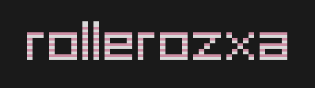

<h2>Open sourcing the ROllerozxa intro.</h2>

The original ROllerozxa intro was created in Camtasia Studio 8 in 720p at 30fps. While it is perfectly alright, I still would want it to be available both in a higher resolution and framerate. I could of course recreate it in Kdenlive... But what's the fun in that?

So instead of recreating it in another video editor, I decided to recreate it **as code.** It has the advantage of easily being scaled up and down to whatever resolution and framerate I'd like, making special logo variants easier to create, and also allows for embedding inside of LÖVE games.

*Welcome to the new, and open source, ROllerozxa intro.*

Currently it is not quite at parity to the original intro, but the goal is to make it more or less identical.